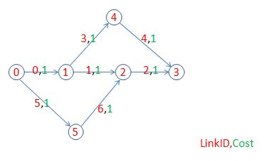

# 华为未来网络挑战赛

本次赛题场景来自于*软件定义网络*，题目要求寻找经过指定点集的两条最短路由，同时使得其相交的点最少。问题规模包含2000个点，40000条边。

这是一道NP难的算法题，我们采用了类似SK66的算法。算法参考了这篇论文[Protected shortest path visiting specified nodes](http://ieeexplore.ieee.org/document/7325218/?arnumber=7325218&tag=1)

值得一提的是我们对程序反复的profile和优化改进过程，我们使用[Oprofile工具](http://www.ibm.com/developerworks/cn/linux/l-pow-oprofile/)对程序进行评测，发现热点，通过改进数据结构的组织，增加数据局部性等手段，必要时**手动[替换STL容器](./future_net/vector_int.h)，甚至使用[AVX向量指令](./future_net/bitset_avx0501.h)**，来对程序加速。经过我们不断努力，程序累计提速12倍以上。最终取得了**京津东北赛区决赛前八强**的成绩。

算法的主要逻辑在[route.cpp](./future_net/route.cpp)中；类似于[op_result_4.txt](./op_result_4.txt)的这些文件展示了程序profile的结果，非常直观。

赛题摘录如下，可参考[大赛官网](http://codecraft.huawei.com/home/detail)。

# 总决赛/复赛赛题描述
## 问题定义
给定一个带权重的有向图G=(V,E)，V为顶点集，E为有向边集，每一条有向边均有一个权重。对于给定的顶点s、t，以及V的子集V’和V’’，寻找从s到t的两条不成环的有向路径P’和P’’，使得P’经过V’中所有的顶点，而P’’经过V’’中所有的顶点（对P’经过V’中顶点的顺序以及P’’经过V’’中顶点的顺序不做要求）。
若不同时存在这样的两条有向路径，则输出无解，程序运行时间越短，则视为结果越优； 若同时存在这样的两条有向路径，则输出得到的两条路径，按下列优先级从高到低评价结果优劣：
> 1.路径P’和P’’重合的有向边个数越少，则视为结果越优；
> 2.在两条路径重合的有向边个数一样的情况下，两条路径权重总和越少，则视为结果越优；
> 3.在上述两个指标一样的情况下，程序运行时间越短，则视为结果越优。

说明：
- 图中所有权重均为[1,100]内的整数；
- 任一有向边的起点不等于终点；
- 连接顶点A至顶点B的有向边可能超过一条，其权重可能一样，也可能不一样；
- 该有向图的顶点不会超过2000个，每个顶点出度（以该点为起点的有向边的数量）不超过20；
- V’和V’’中元素个数均不超过100，交集为空，且不包含起始顶点s和终止顶点t；
- 从s到t的不成环有向路径P是指，P为由一系列有向边组成的从s至t的有向连通路径，且不允许重复经过任一顶点；
- 路径的权重是指所有组成该路径的所有有向边的权重之和（重复边的权重应分别在两条路径中各计算一次）。

## 输入与输出

输入文件格式
以两个.csv文件（csv是以逗号为分隔符的文本文件）给出输入数据，一个为图的数据(G)，一个为需要计算的路径信息(s,t,V’,V’’)。文件每行以换行符（ASCII’\n’即0x0a）为结尾。

1）图的数据中，每一行包含如下的信息：
*LinkID,SourceID,DestinationID,Cost*
其中，LinkID为该有向边的索引，SourceID为该有向边的起始顶点的索引，DestinationID为该有向边的终止顶点的索引，Cost为该有向边的权重。顶点与有向边的索引均从0开始编号(不一定连续，但用例保证索引不重复)，顶点索引范围在[0，2000)，有向边索引范围在[0，40000)。
2）路径信息中，只有一行如下数据：
*DemandID,SourceID,DestinationID,IncludingSet*
其中，DemandID里面第一行为1，第二行为2，表示路径索引，1表示P’，2表示P’’，SourceID为起始顶点s的索引，DestinationID为终止顶点t的索引，IncludingSet表示必须经过的顶点集合V’或V’’，其中不同的顶点索引之间用“ | ”分割，如果该路径没有必经顶点要求，则此处输入NA。
输出文件格式
输出文件同样为一个.csv 文件。
1）如果该测试用例存在满足要求的有向路径P’和P’’，则输出两行信息，第一行按P’经过的有向边顺序，依次输出有向边的索引，索引之间用“ | ”分割；第二行按P’’经过的有向边顺序依次输出有向边的索引，索引之间用“ | ”分割；
2）如果该测试用例不同时存在两条满足要求的有向路径P’和P’’，则只输出一行信息：NA；
3）每一行只允许输出最多一条有向路径，以换行符0x0a结尾。

## 单个用例的评分机制

### 有解用例的排名机制

按下面流程对参赛者结果进行排名：
Step1： 对于提交的结果，进行合法性检验(详见题目描述)；
Step2： 程序运行时间不得超过10s；
若不满足上述的结果则本用例得分为0；
Step3： 路径P’和P’’重合的有向边个数（不考虑权重）越少，排名越优；
Step4： 在路径P’和P’’重合的有向边个数一样的情况下，计算P’和P’’的权重和，权重越小，排名越优；
Step5： 在上述两个指标一样的情况下，用程序运行时间细化排名，时间越短，排名越优。

### 无解用例的排名机制

按下列流程对参赛者结果进行排名：
Step1： 对于提交的结果，验证是否识别出该用例无解，若无法识别或者程序运行时间超10s，则本用例得分为0；
Step2： 用程序的运行时间进行排名，时间越短，排名越优。
单个用例的评分标准如下：
根据上面排名流程得到的排名，使用标准分计分(排名第一的提交者为100分)。
若所有人均未得到正确结果，则所有人均得分为0。

## 网站系统判分机制

复赛阶段官方网站开放接收复赛程序提交，系统平台会使用N个测试用例在线判题，参赛者对于每个测试用例都会得到一个百分制分数，使用算术平均分为该参赛者的最终得分，并展示在各区域复赛排行榜中。
特别说明：复赛阶段的在线判题评分及排行仅供参赛者参考，不纳入最终复赛成绩。

## 简单用例说明

在如上图所示的有向图中，我们会得到下面的有向图信息：
0,0,1,1
1,1,2,1
2,2,3,1
3,1,4,1
4,4,3,1
5,0,5,1
6,5,2,1
如果此时需要寻找从0到3的路径P’和P’’，且P’必须经过顶点1，P’’必须经过顶点2，相应的路径信息文件内容为：
1,0,3,1
2,0,3,2
对于该用例，可以找到如下两组解:
0|1|2
5|6|2
以及
0|3|4
5|6|2
由于第一组解两条路径的重合边个数为1，第二组解两条路径的重合边个数为0。所以此时最优解应该是0|3|4，5|6|2。

更详细的问题描述，以及赛体测试数据，可参考[大赛官网](http://codecraft.huawei.com/home/detail)。